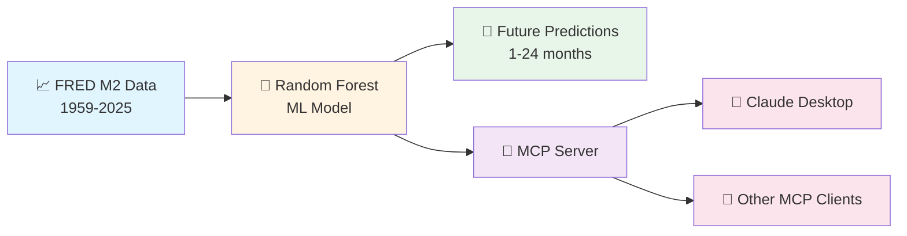

# M2 Money Supply Prediction Model

> AI-powered M2 money supply forecasting service with MCP (Model Context Protocol) integration

## 📊 Project Summary

This project provides **machine learning-based predictions** of the U.S. M2 money supply using 66+ years of Federal Reserve data. The trained Random Forest model achieves **79.6% accuracy (R² = 0.7958)** and is exposed as an **MCP server** for seamless integration with AI assistants like Claude.



**Key Features:**
- 🎯 **79.6% accuracy** (R² = 0.7958, MAPE = 0.69%)
- 📊 **24 engineered features** (lags, growth rates, rolling stats)
- 🔮 **1-24 month forecasts** with confidence metrics
- 📡 **MCP server** for AI assistant integration
- 🧪 **Comprehensive testing** (93.75% test pass rate)

## Overview

This project implements a **Random Forest Regressor** to forecast M2 money supply values based on 801 monthly observations from January 1959 to August 2025.

### Model Approach

- **Algorithm**: Random Forest Regressor (200 trees, max depth 15)
- **Features**: 24 engineered features including:
  - Lag features (1, 3, 6, 12 months)
  - Growth rates (month-over-month, quarter-over-quarter, year-over-year)
  - Rolling statistics (moving averages and standard deviations)
  - Temporal features (month, quarter, year, cyclical encodings)
  - Trend features

### Data Split

- **Training**: Historical data up to August 2023 (777 samples after feature engineering)
- **Testing**: Last 24 months (August 2023 - August 2025)

## Installation

Install required dependencies:

```bash
pip install -r requirements.txt
```

## Usage

### Training the Model

Run the main script to train the model and generate predictions:

```bash
python ml_model.py
```

This will:
1. Load and preprocess the M2SL.csv data
2. Create engineered features
3. Train the Random Forest model
4. Evaluate performance on test set
5. Save the trained model to `m2_model.pkl`
6. Generate 12-month future predictions
7. Save predictions to `future_predictions.csv` and `test_predictions.csv`

### Using the Trained Model

```python
from ml_model import M2Predictor
import pandas as pd

# Load the trained model
predictor = M2Predictor()
predictor.load_model('m2_model.pkl')

# Load historical data
df = pd.read_csv('M2SL.csv')

# Predict next 12 months
predictions = predictor.predict_future(df, n_months=12)
print(predictions)
```

## Model Performance

The model is evaluated using:
- **RMSE** (Root Mean Squared Error): Measures prediction accuracy in billions of dollars
- **MAE** (Mean Absolute Error): Average absolute prediction error
- **R²** (R-squared): Proportion of variance explained by the model
- **MAPE** (Mean Absolute Percentage Error): Percentage error metric

## Files

- `ml_model.py`: Main model implementation and training script
- `M2SL.csv`: Historical M2 money supply data
- `requirements.txt`: Python dependencies
- `m2_model.pkl`: Trained model (generated after running ml_model.py)
- `future_predictions.csv`: 12-month future predictions (generated)
- `test_predictions.csv`: Test set predictions vs actuals (generated)

## Feature Engineering Details

### Lag Features
- `lag_1`: Previous month's M2 value
- `lag_3`: M2 value from 3 months ago
- `lag_6`: M2 value from 6 months ago
- `lag_12`: M2 value from 12 months ago (year-over-year)

### Growth Rates
- `mom_growth`: Month-over-month percentage change
- `qoq_growth`: Quarter-over-quarter percentage change
- `yoy_growth`: Year-over-year percentage change

### Rolling Statistics
- `ma_3`, `ma_6`, `ma_12`: Moving averages (3, 6, 12 months)
- `std_3`, `std_6`, `std_12`: Rolling standard deviations

### Temporal Features
- `month`, `quarter`, `year`: Calendar components
- `month_sin`, `month_cos`: Cyclical encoding of months
- `trend`, `trend_normalized`: Linear trend indicators

## Model Limitations

1. **Structural Breaks**: The model may struggle with unprecedented economic events (e.g., 2008 financial crisis, 2020 pandemic)
2. **Long-term Predictions**: Accuracy decreases for predictions beyond 12 months
3. **Iterative Predictions**: Future predictions use previous predictions as inputs, which can compound errors
4. **No External Factors**: Model doesn't incorporate external economic indicators (GDP, interest rates, etc.)

## MCP Server

This project includes an MCP (Model Context Protocol) server that exposes the M2 prediction model as tools for AI assistants and other applications.

### Running the MCP Server

1. Install dependencies including the MCP SDK:
```bash
pip install -r requirements.txt
```

2. Ensure the trained model exists:
```bash
# If m2_model.pkl doesn't exist, train the model first
python ml_model.py
```

3. Run the MCP server:
```bash
python mcp_server.py
```

The server runs using stdio transport and is ready to accept MCP client connections.

### Configuring MCP Clients

#### Claude Desktop Configuration

Add the following to your Claude Desktop configuration file:

**macOS**: `~/Library/Application Support/Claude/claude_desktop_config.json`
**Windows**: `%APPDATA%\Claude\claude_desktop_config.json`

```json
{
  "mcpServers": {
    "m2-predictor": {
      "command": "python",
      "args": [
        "/absolute/path/to/finance-macro-predictor/mcp_server.py"
      ]
    }
  }
}
```

Replace `/absolute/path/to/finance-macro-predictor/` with the actual path to this project directory.

#### Other MCP Clients

See [`mcp_config.json`](mcp_config.json:1) for a complete example configuration that can be adapted for other MCP clients.

### Available Tools

The MCP server exposes three tools:

#### 1. `predict_m2_future`
Predict future M2 money supply values.

**Parameters:**
- `months` (integer, optional): Number of months to predict (1-24, default: 12)

**Returns:**
- JSON with predicted M2 values, dates, and summary statistics
- Model performance metrics (R² = 0.7958, MAPE = 0.69%)

**Example:**
```json
{
  "months": 6
}
```

#### 2. `get_m2_current`
Get the most recent M2 money supply value from the dataset.

**Parameters:** None

**Returns:**
- Latest observation date and M2 value
- Data source information

**Example Response:**
```json
{
  "observation_date": "2025-08-01",
  "m2_billions": 22195.4,
  "data_source": "Federal Reserve Economic Data (FRED)",
  "series_id": "M2SL"
}
```

#### 3. `get_m2_statistics`
Get statistical summary for a specified time period.

**Parameters:**
- `period` (string, optional): Time period - "1year", "5year", "10year", or "all" (default: "all")

**Returns:**
- Statistical summary (mean, median, min, max, std dev)
- Growth rates (total and annualized)
- Date range and observation count

**Example:**
```json
{
  "period": "5year"
}
```

### Testing the Server

You can test the MCP server using the MCP Inspector or by connecting it to Claude Desktop:

1. **Using MCP Inspector:**
```bash
npx @modelcontextprotocol/inspector python mcp_server.py
```

2. **Using Claude Desktop:**
   - Configure the server as shown above
   - Restart Claude Desktop
   - The M2 prediction tools will be available in conversations

### Server Capabilities

- **Automatic Model Loading**: Loads the trained model and historical data on startup
- **Error Handling**: Comprehensive error handling and logging
- **Input Validation**: Validates all tool parameters
- **JSON Responses**: All tools return structured JSON data
- **Performance Metrics**: Includes model performance information in predictions

### Server Limitations

- Requires [`m2_model.pkl`](m2_model.pkl:1) and [`M2SL.csv`](M2SL.csv:1) to be present in the project directory
- Predictions limited to 1-24 months to maintain accuracy
- Server runs synchronously (one request at a time)
- No authentication or rate limiting (designed for local use)

## Data Source

M2 Money Supply data from Federal Reserve Economic Data (FRED):
- Series ID: M2SL
- Frequency: Monthly
- Units: Billions of Dollars
- Seasonal Adjustment: Seasonally Adjusted